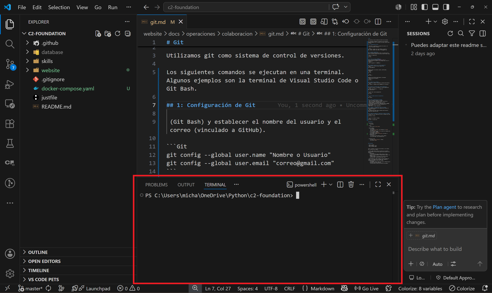

# Configurar Git

Utilizamos git como sistema de control de versiones.

Los siguientes comandos se ejecutan en una terminal. Puedes utilizar, por ejemplo, la terminar de Visual Studio Code o Git Bash.



## Configuración inicial
### Configuración de Git

Si es tu primera vez utilizando git, deberás establecer el nombre del usuario y el correo (vinculado a GitHub).

```shell
git config --global user.name "Nombre o Usuario"
git config --global user.email "correo@gmail.com"
```
Para empezar a trabajar con un repositorio, tienes **dos opciones**:

- Inicializar un repositorio nuevo
- Clonar un repositorio existente
  
### Inicializar un repositorio nuevo
Iniciar la carpeta actual como repositorio.

```shell
git init
```
Luego de [crear tu repositorio en Github](../colaboracion/github.md), ejecuta este comando para vincular tu repositorio local con el repositorio remoto.

```shell
git remote add origin https://github.com/tu-usuario/nombre-del-repositorio.git
```

### Clonar un repositorio existente

```shell
git clone [url_del_repo]
```  


## Discusión

- Fork o clone?
- Nunca pushear a main
- PRs al Product Owner


Otros "sistemas" de control de versiones y las razones por las que no las usamos:

- Local: Cada usuario tiene un archivo en su máquina. Para colaborar, le envía una copia de ese archivo a otro usuario.
  - Desventajas:
    - Si dos personas hacen cambios sobre el mismo archivo y se lo comparten, alguien debe "juntar" los cambios en uno.
    - Muchas copias o versiones de un mismo archivo (version_final, version_final_final, etc).
    
- Collab/Onedrive: Todos acceden al mismo documento en línea, y los cambios son en tiempo real. Guarda un historial de cambios cada cierto tiempo.
  - Desventajas: 
    - Un pequeño cambio puede hacer que el código deje de funcionar para otros usuarios.
    - No hay control total del historial de cambios.
