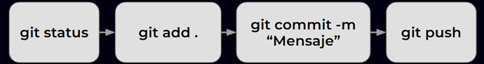

# Workflow de Git

Utilizamos git como sistema de control de versiones.


## Workflow individual



### 3: Ver estado actual del repositorio
Mira información importante, como la rama actual, los cambios en los archivos, los cambios añadidos al área de preparación, los archivos nuevos, los archivos borrados, etc.
```shell
git status
```

### 4: Agregar archivos al área de preparación
Agregar uno o varios archivos específicos
```shell
git add README.md
```

Agregar todos los archivos (nuevos, modificados, eliminados).
```shell
git add .
```
!!! note
    También puedes usar `git add -A`, que es equivalente.

Agregar solo archivos modificados y eliminados (actualización de cambios).
```shell
git add -u
```

### 5: Commit de los cambios
Se guarda los cambios incluyendo un mensaje descriptivo.
```shell
git commit -m "Agrega archivo README.md y X archivos"
```


### 9: Sube los cambios al repositorio remoto en GitHub
La rama master del repositorio local se renombra por main
```shell
git branch -M main
```

Se envía los cambios a GitHub
```shell
git push -u origin main
```
!!! note
    Luego de primer commit, basta con utilizar `git push`.

## Reparar errores
### 1: Ver estado actual del repositorio
Recuerda siempre comenzar con `git status` para ver información importante, como la rama actual, los cambios en los archivos, los cambios añadidos al área de preparación, los archivos nuevos, los archivos borrados, etc.
```shell
git status
```

### 6: Retirar un archivo del área de preparación
Se crea un archivo y se agrega al área de preparación.
Como ejemplo, creamos un archivo "Nota.txt"
```shell
git echo "Recordatorio ..." > Nota.txt
git add Nota.txt
```

Se retira del área de preparación.
```shell
git reset Nota.txt
```

### Quitar del staging area
```shell
git reset README.md
```
!!! warning
    Se puede utilizar también `git restore --staged [archivo]`. No obstante, recordar que olvidar el flag `--staged` hará que git no solo quite el archivo del área de preparación, sino que que también reestablecerá el archivo desde el último commit, sin forma de recuperar los cambios.

### Enmendar el mensaje del último commit
Si te equivocaste en el mensaje de tu último commit y no lo has pusheado aún, siempre se puede enmendar con el flag `--amend` o `-a`.

```shell
git commit -a -m "Nuevo mensaje"
```
### Restablecer a una versión anterior
Si hiciste un commit y aún no lo pusheas, puedes restablecer a una versión anterior.

```shell
git commit -a -m "Nuevo mensaje"
```

## Workflow colaborativo

- Inicializar 
    - git init

- Clonar
    - git clone [url_del_repo]

- Subir cambios
    - git status
    - git switch -c [rama] / git checkout -b [rama]
    - git add [ruta]
    - git restore --staged [ruta] (quitar de staging area si no se quiere subir)
    - git commit -m [mensaje]
    - git commit --amend -m [mensaje] (corregir el mensaje anterior)
    - git push
    - Ir al enlace para generar la pull request
    - git switch main / git checkout main


- Actualizar repo
    - git pull [repo] [branch] --rebase
    - git fetch [repo]
  


## Discusión

- Fork o clone?
- Nunca pushear a main
- PRs al Product Owner


Otros "sistemas" de control de versiones y las razones por las que no las usamos:

- Local: Cada usuario tiene un archivo en su máquina. Para colaborar, le envía una copia de ese archivo a otro usuario.
  - Desventajas:
    - Si dos personas hacen cambios sobre el mismo archivo y se lo comparten, alguien debe "juntar" los cambios en uno.
    - Muchas copias o versiones de un mismo archivo (version_final, version_final_final, etc).
    
- Collab/Onedrive: Todos acceden al mismo documento en línea, y los cambios son en tiempo real. Guarda un historial de cambios cada cierto tiempo.
  - Desventajas: 
    - Un pequeño cambio puede hacer que el código deje de funcionar para otros usuarios.
    - No hay control total del historial de cambios.
