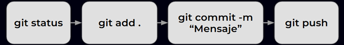

# Workflow de Git

Utilizamos git como sistema de control de versiones.


## Workflow individual



### 1: Ver estado actual del repositorio
Recuerda siempre comenzar con este comando para revisar información importante, como la rama actual, los cambios en los archivos, los cambios añadidos al área de preparación, los archivos nuevos, los archivos borrados, etc.
```shell
git status
```

### 2: Agregar archivos al área de preparación
Agregar uno o varios archivos específicos
```shell
git add README.md
```

Agregar todos los archivos (nuevos, modificados, eliminados).
```shell
git add .
```
!!! note
    También puedes usar `git add -A`, que es equivalente.

Agregar solo archivos modificados y eliminados (actualización de cambios).
```shell
git add -u
```

### 3: Commit de los cambios
Se guardan los cambios, incluyendo un mensaje descriptivo.

```shell
git commit -m "chore: Agrega archivo README.md y X archivos"
```
!!! note
    Recuerda que en C2 es obligatorio utilizar [Conventional Commits](conventional_commits.md)


### 4: Sube los cambios al repositorio remoto en GitHub
Se envía los cambios a GitHub
```shell
git push -u origin main
```
!!! note
    Luego de primer commit, basta con utilizar `git push`.

!!! warning
    Recuerda renombrar la rama master por main si no viene por defecto con el siguiente comando:
    ```shell
    git branch -M main
    ```


## Reparar errores
### Ver estado actual del repositorio
Recuerda siempre comenzar con `git status` para ver información importante, como la rama actual, los cambios en los archivos, los cambios añadidos al área de preparación, los archivos nuevos, los archivos borrados, etc.
```shell
git status
```

### Enmendar el mensaje del último commit
Si te equivocaste en el mensaje de tu último commit y no lo has pusheado aún, siempre se puede enmendar con el flag `--amend`.

```shell
git commit --amend -m "feat: Nuevo mensaje"
```

### Retirar un archivo del área de preparación
Se crea un archivo y se agrega al área de preparación.
Como ejemplo, creamos un archivo "Nota.txt"
```shell
git echo "Recordatorio ..." > Nota.txt
git add Nota.txt
```

Se retira del área de preparación (staging area)
```shell
git reset Nota.txt
```

!!! warning
    Se puede utilizar también `git restore --staged [archivo]`. No obstante, recordar que olvidar el flag `--staged` hará que git no solo quite el archivo del área de preparación, sino que que también reestablecerá el archivo desde el último commit, sin forma de recuperar los cambios.

### Traer de vuelta un commit enviado 
Si hiciste push a un commit, puedes regresar los archivos commiteados al área de preparación con el siguiente comando:

```shell
git reset --soft HEAD~1
```
